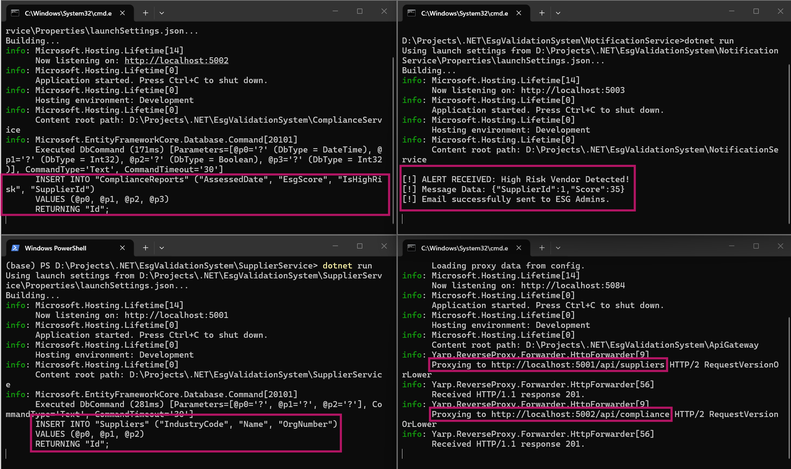

# 🌱 ESG Microservices Demo (Learning Project)

This is a small Proof of Concept (PoC) project I built to learn the basics of Microservices architecture using **.NET 10**. 

Instead of building one large application, I split a simple ESG (Environmental, Social, and Governance) vendor check into tiny, independent services to understand how they communicate.

## 📚 Concepts Explored
*   **API Gateway (YARP):** Having a single entry point for all API requests.
*   **Database-per-service:** Both the Supplier and Compliance services have their own isolated PostgreSQL tables. They don't share a database.
*   **Event-Driven Communication (RabbitMQ):** Using a message broker so services can talk to each other in the background without waiting.

## 🏗️ The Services
1.  **ApiGateway (Port 5000):** The front door that routes incoming requests.
2.  **SupplierService (Port 5001):** Simply saves and retrieves basic vendor details.
3.  **ComplianceService (Port 5002):** Checks the vendor's ESG score. If the score is below 50 (High Risk), it fires a message into RabbitMQ.
4.  **NotificationService (Port 5003):** A background worker that listens to RabbitMQ. When it hears a "High Risk" message, it prints an alert to the console.

